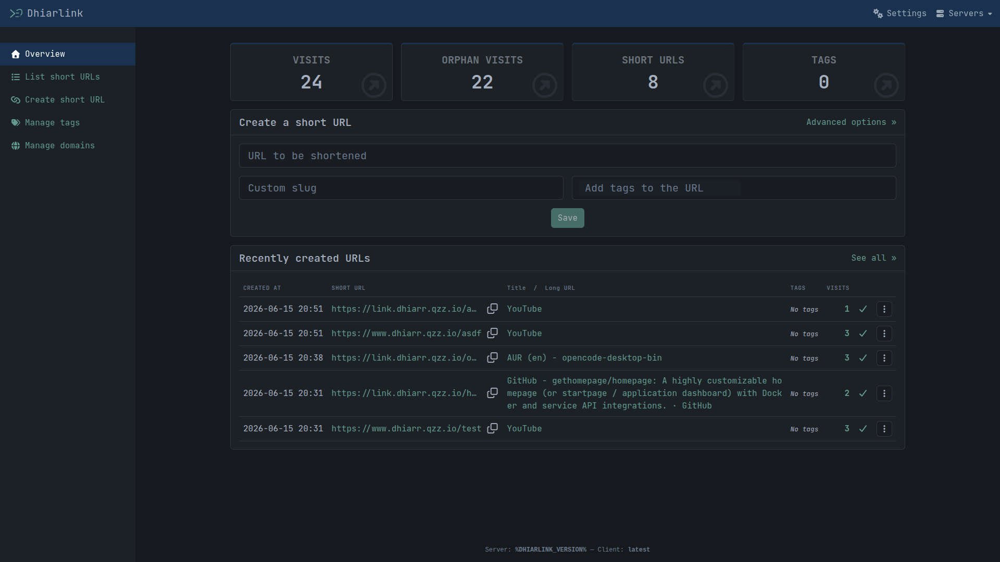
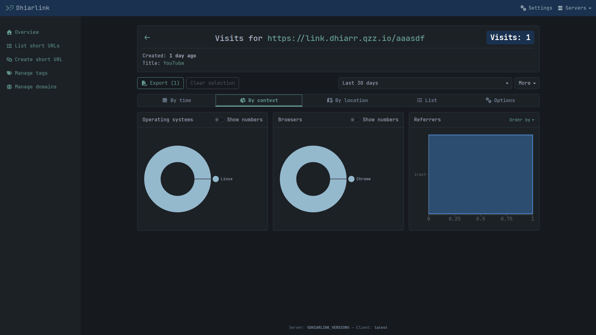

# Dhiarlink Web Client

A React-based Progressive Web App (PWA) dashboard for the [Dhiarlink](https://github.com/dhiarlink/dhiarlink) self-hosted URL shortener. Built with a **Terminal / Hacker aesthetic** (Deep Ocean palette) and deployed at **[app.dhiarr.qzz.io](https://app.dhiarr.qzz.io)**.

> Rebranded fork of [shlink-web-client](https://github.com/shlinkio/shlink-web-client), customized for the Dhiarlink platform.





---

## Features

- Create & manage short URLs with custom slugs, expiration, tags, and metadata
- Visit analytics with real-time updates (Mercure SSE)
- Multi-server support — connect to multiple Dhiarlink instances
- Import/export server configurations
- Progressive Web App — installable, offline-capable
- Fully responsive (desktop + mobile)
- Dark-only terminal UI with JetBrains Mono typography

For full technical details, see [documentation/docs.md](documentation/docs.md).

---

## Quick Start

### Prerequisites

| Tool | Version |
|------|---------|
| Node.js | >= 22.x |
| npm | >= 10.x |
| Docker | >= 24.x *(for production)* |

### Local Development

```bash
git clone https://github.com/dhiarlink/dhiarlink-web-client.git
cd dhiarlink-web-client
npm install
npm start
```

Opens on **http://localhost:3000** with hot reload. Add a server by clicking **"Add a server"** and entering your Dhiarlink backend URL + API key.

### Production (Docker)

```bash
# Build
docker build -t dhiarlink-web-client .

# Run with pre-configured server
docker run -d \
  --name dhiarlink_web_client \
  -p 8080:8080 \
  -e DHIARLINK_SERVER_URL=https://www.dhiarr.qzz.io \
  -e DHIARLINK_SERVER_API_KEY=your-api-key \
  -e DHIARLINK_SERVER_NAME="Dhiarlink" \
  dhiarlink-web-client
```

Serves via nginx on port **8080** as a non-root user (UID 101).

### Production (Static Files)

```bash
npm run build
```

Outputs optimized static files to `build/`. Serve with any HTTP server (nginx, Caddy, Apache). Your server must fall back to `index.html` for client-side routing — see [config/docker/nginx.conf](config/docker/nginx.conf).

---

## Using Dhiarlink Web Client

Once the dashboard is running, you can:

1. **Add a server** — Enter your Dhiarlink backend URL and API key to connect
2. **Create short URLs** — Generate short links with custom slugs, tags, expiration dates
3. **Monitor visits** — View click analytics, referrers, browsers, devices, and geolocation
4. **Manage servers** — Switch between multiple Dhiarlink instances, import/export configs
5. **Install as PWA** — Add to your device's home screen for an app-like experience

### Pre-configuring a Server

You can skip the manual server setup by providing environment variables or a `servers.json` file. See [documentation/docs.md](documentation/docs.md#pre-configuring-servers) for details.

---

## Documentation

| Document | Description |
|----------|-------------|
| [docs.md](documentation/docs.md) | Full project docs — tech stack, architecture, design system, dependencies, env vars, project structure, scripts, backend integration, troubleshooting |
| [deployment.md](documentation/deployment.md) | Deployment guide — local dev, Docker, Cloudflare Tunnel, server pre-configuration |
| [prompt-history.md](documentation/prompt-history.md) | Development conversation log — design decisions, iteration history |
| [to-do.md](documentation/to-do.md) | Rebrand task tracker — completed and remaining work |

---

## Contributing

1. Fork the repository
2. Create a feature branch: `git checkout -b feature/my-change`
3. Make your changes
4. Verify: `npm run types` + `npm run lint` + `npm test`
5. Commit and push: `git push origin feature/my-change`
6. Open a pull request

### Available Scripts

| Command | Description |
|---------|-------------|
| `npm start` | Dev server on port 3000 |
| `npm run build` | Production build |
| `npm run lint` | Run linter |
| `npm run lint:fix` | Auto-fix lint issues |
| `npm run types` | Type-check without building |
| `npm test` | Run tests |

---

## Credits

Rebranded fork of [shlink-web-client](https://github.com/shlinkio/shlink-web-client) by [shlinkio](https://shlink.io) (MIT License).

**Dhiarlink rebrand changes:**
- Terminal / Hacker aesthetic with Deep Ocean color palette
- Rebranded UI text, logos, and metadata
- Tailwind CSS v4 theme overrides for upstream component libraries
- Docker and deployment scripts adapted for Dhiarlink
- Environment variable namespace: `SHLINK_*` → `DHIARLINK_*`

---

## License

[MIT License](LICENSE)
